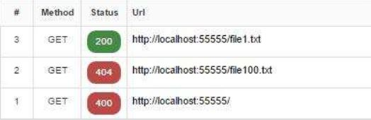
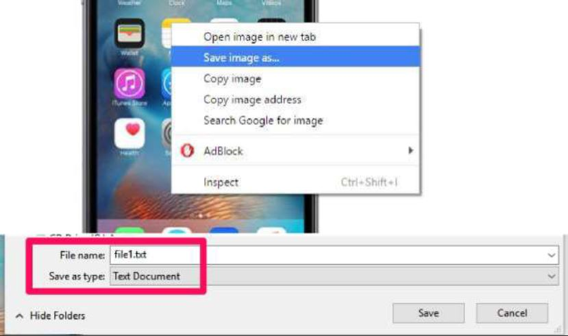

# Image Steganography over a Custom Web Server

Hide a text file inside an ordinary-looking PNG, serve it from a web server I
wrote from scratch on raw sockets, and pull the message back out with a small
decoder.

I built this to really understand two things at once: least-significant-bit
(LSB) steganography, and what an HTTP server actually does once you strip away
the framework. A client requests `/fileN.txt`; instead of the text, it gets a
PNG with that text invisibly woven into the pixels. To the eye the image is
unchanged — every colour value moves by at most 1.

## How it works

The message is turned into a stream of bits and written one bit at a time into
the least significant bit of each red, green, and blue channel — so three
pixels carry roughly one byte of data. A short marker (a `1` followed by a long
run of zeros) is appended so the decoder knows exactly where the message ends.
Decoding just reads those LSBs back in the same order until it sees the marker.

## Tech stack

- **Python 3.9+**
- **[Pillow](https://python-pillow.org/)** for reading and writing PNG pixels
- The standard library `socket`, `re`, and `os` modules for the hand-rolled
  HTTP server — no web framework

## Features

- Encodes any of the bundled text files into a randomly chosen 24-bit PNG
- Serves the encoded image over HTTP with the correct `image/png` MIME type
- Returns proper `400 Bad Request` and `404 Not Found` responses for bad or
  unknown requests
- Ships a standalone decoder so anyone can recover the message from an image
- Leaves no visible trace in the carrier image

## Project structure

```
.
├── src/steganography/
│   ├── bits.py        # LSB get/set + text <-> bits conversion
│   ├── encoder.py     # embed text into a carrier PNG
│   ├── decoder.py     # recover text from an encoded PNG (also a CLI)
│   └── server.py      # socket HTTP server that encodes on request
├── assets/carriers/   # 1.png .. 5.png, the 24-bit carrier images
├── samples/           # file1.txt .. file10.txt, sample payloads
├── tests/             # round-trip and server tests
└── docs/images/       # screenshots used in this README
```

## Getting started

I recommend a virtual environment, then an editable install so the
`steg-server` and `steg-decode` commands are available:

```bash
python -m venv .venv
source .venv/bin/activate        # on Windows: .venv\Scripts\activate
pip install -e .
```

Prefer not to install anything? Just add the package to the path:

```bash
pip install -r requirements.txt
export PYTHONPATH=src            # on Windows: set PYTHONPATH=src
```

## Running it

### Encoding (the server)

```bash
steg-server                      # or: python -m steganography.server
```

Then:

1. Visit <http://localhost:55555> — you'll get a `400 Bad Request`, because the
   bare path isn't something the API knows how to answer.
2. Visit <http://localhost:55555/file1.txt> to receive the contents of
   `file1.txt` encoded into a random carrier image.
3. Save the response. Make sure you save it as a `.png`.
4. Any file from `file1.txt` to `file10.txt` works; anything else (say
   `file50.txt`) returns `404 Not Found`.

### Decoding

```bash
steg-decode path/to/encoded.png  # or: python -m steganography.decoder <image>
```

It prints the recovered text to stdout.

## Running the tests

```bash
pip install pytest
pytest
```

The suite round-trips every sample file through encode → decode and checks the
server's `400`/`404`/`200` responses.

## Screenshots

The server returns the right HTTP status for each kind of request:



Because the client asked for a `.txt`, the browser still wants to save the
result as text, so I have to pick the `.png` type by hand when saving:



## Notes and limitations

- A few details I'm happy with: I use bit hacks to set/clear the LSB, pack one
  bit into every channel, and use a regular expression to pull the requested
  file number out of the raw HTTP request. In a quick benchmark, hiding a
  ~492 KB book in a 3.2 MB image took about 7 seconds to encode and 6 to
  decode, and the encoder handles the full range of ASCII characters.
- Because the client requested a `.txt`, the browser assumes the response is
  text. The response does say `Content-type: image/png`, but the browser still
  nudges you to save it as text — so you have to choose the PNG type manually.
  A natural fix would be to redirect `/file1.txt` to `/file1.png` over HTTP
  headers before serving the image.
- The server is a deliberately minimal teaching implementation: single
  connection at a time, no TLS, and it reads only the first 4 KB of each
  request.

## What I learned

This was where HTTP stopped being magic for me — once you've written the status
line and headers by hand, the protocol is just text over a socket. It was also
a satisfying first encounter with the idea that you can hide information in
plain sight without anyone being able to tell.

## License

Released under the [MIT License](LICENSE).
